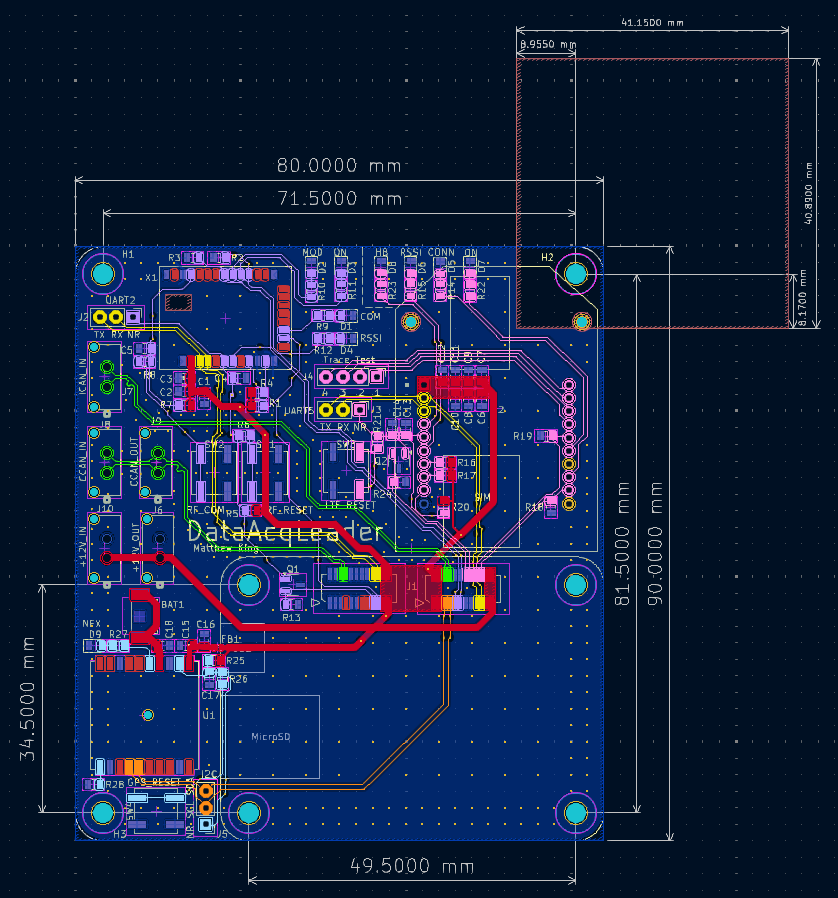

# DataAcquisitionLeaderPCB

This PCB is designed for our solar vehicle to collect electrical and mechanical sensor data and transmit it wirelessly via LTE for real-time access. It also includes a GPS module for location tracking and an RF module as a backup communication system.

## LED Descriptions

LTE LEDs:

* HB (D8): Heartbeat.
  * Blinking = Our code is running on module.
* RSSI (D6): Received Singal Strength Integrity.
  * PWM based on strength (brighter = better).
* CONN (D5): Connection Indicator.
  * On, solid = Not connected.
  * 1/2 sec period blink = Last transmit failed.
  * 1 sec blink period = Normal operation.
* ON (D7): On.
  * On = Module is on.

RF LEDs:

* MOD (D2): Module status.
  * Blinking = Device is powered and operating properly.
  * Off = Device is alseep.
* ON (D3): On.
  * On = Module is on.
* RSSI (D4): Received Singal Strength Integrity.
  * PWM based on strength (brighter = better).

GPS LED:

* NFX (D9): Negative 3D Fix.
  * Blinking (2 sec period) = Searching for satellites, no position fix.
  * Off = Acquired satellite signal.

## Testpoint Descriptions

LTE Testpoints:

* UART5 (J3)
  * Pin 3 TX = Transmit
  * Pin 2 RX = Receive
  * Pin 1 NR = Negative Reset (Note: this is not a UART singal, it is the module NRESET singal)

* Test Trace (J4)
  * Provides access to 4 pins (traces) to help in debugging code on the LTE module.

RF Testpoints:

* UART2 (J2)
  * Pin 3 TX = Transmit
  * Pin 2 RX = Receive
  * Pin 1 NR = Negative Reset (Note: this is not a UART singal, it is the module NRESET singal)

GPS Testpoints:

* I2C (J5)
  * Pin 3 SDA = Serial Data
  * Pin 2 SCL = Serial Clock
  * Pin 1 NR = Negative Reset (Note: this is not a I2C singal, it is the module NRESET singal)

## PCB

## Schematic

[PDF](DataAcqLeaderBoard_Schematic.pdf)

## BOM

Pending
<!-- [**BOM**](bom/DataAcq-LeaderPCB.csv)   -->
<!-- [**IBOM**](bom/ibom.html) -->
