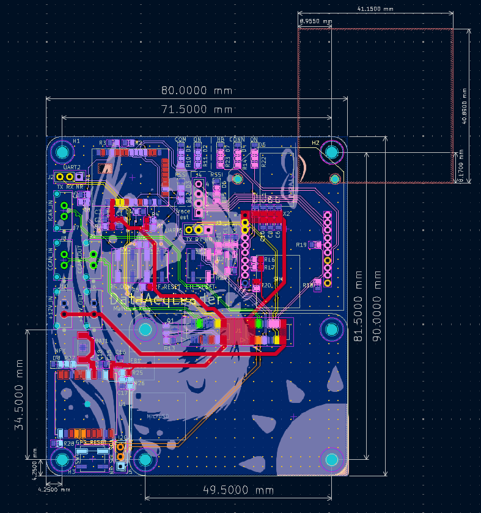

# DataAcquisitionLeaderPCB

This PCB is designed for our solar vehicle to collect electrical and mechanical sensor data and transmit it wirelessly via LTE for real-time access. It also includes a GPS module for location tracking and an RF module as a backup communication system.

## LED Descriptions

LTE LEDs:

* HB (D7): Heartbeat.
  * Blinking = Our code is running on module.
* RSSI (D5): Received Singal Strength Integrity.
  * PWM based on strength (brighter = better).
* CONN (D4): Connection Indicator.
  * On, solid = Not connected.
  * 1/2 sec period blink = Last transmit failed.
  * 1 sec blink period = Normal operation.
* ON (D6): On.
  * On = Module is on.

RF LEDs:

* COM (D1): Commissioning (associate) status.
  * Blinking = Device is powered and operating properly.
  * Off = Device is alseep.
  * Note: blinks with certain patterns depending on number of RF_COM button presses (see datasheet).
* ON (D2): On.
  * On = Module is on.
* RSSI (D3): Received Singal Strength Integrity.
  * PWM based on strength (brighter = better).

GPS LED:

* NFX (D8): Negative 3D Fix.
  * Blinking (2 sec period) = Searching for satellites, no position fix.
  * Off = Acquired satellite signal.

## Testpoint Descriptions

LTE Testpoints:

* UART5 (J3)
  * Pin 3 TX = Transmit
  * Pin 2 RX = Receive
  * Pin 1 NR = Negative Reset (Note: this is not a UART singal, it is the module NRESET singal)

* Test Trace (J4)
  * Provides access to 4 pins (traces) to help in debugging code on the LTE module.

RF Testpoints:

* UART2 (J2)
  * Pin 3 TX = Transmit
  * Pin 2 RX = Receive
  * Pin 1 NR = Negative Reset (Note: this is not a UART singal, it is the module NRESET singal)

GPS Testpoints:

* I2C (J5)
  * Pin 3 SDA = Serial Data
  * Pin 2 SCL = Serial Clock
  * Pin 1 NR = Negative Reset (Note: this is not a I2C singal, it is the module NRESET singal)

## Pushbutton Descriptions

LTE_RESET: When pressed LTE module resets.
GPS_RESET: When pressed GPS module resets.
RF_RESET: When pressed RF module resets.
RF_COM: RF Commissioning button (see datasheet).

## PCB

## Schematic

[PDF](DataAcqLeaderBoard_Schematic.pdf)

## BOM

[BOM](DataAcqLeaderBoard/bom/bom.csv)
[IBOM](DataAcqLeaderBoard/bom/ibom.html)
[Mouser Cart](https://www.mouser.com/ProjectManager/ProjectDetail.aspx?AccessID=583e28cb45)

Cart does not include: 

  - [GPS Ferite Bead](https://www.digikey.com/en/products/detail/pulse-electronics/GMLB-100505-0600A-N8/12417638)
  - [GPS Module]( https://www.adafruit.com/product/790?gad_source=1&gclid=Cj0KCQiAsaS7BhDPARIsAAX5cSBvdF13g1xnso75e2ID2pkFIsjjoOZ1HywqQ3y7T4lSuiXb9zWTkFsaAgU-EALw_wcB)
  - [Digi XBee LTE Module](https://www.digi.com/products/embedded-systems/digi-xbee/cellular-modems/digi-xbee-3-global-lte-cat-4#partnumbers )
  - [Digi XBee RF Module](https://www.digi.com/products/embedded-systems/digi-xbee/rf-modules/sub-1-ghz-rf-modules/digi-xbee-xr-900#partnumbers)
